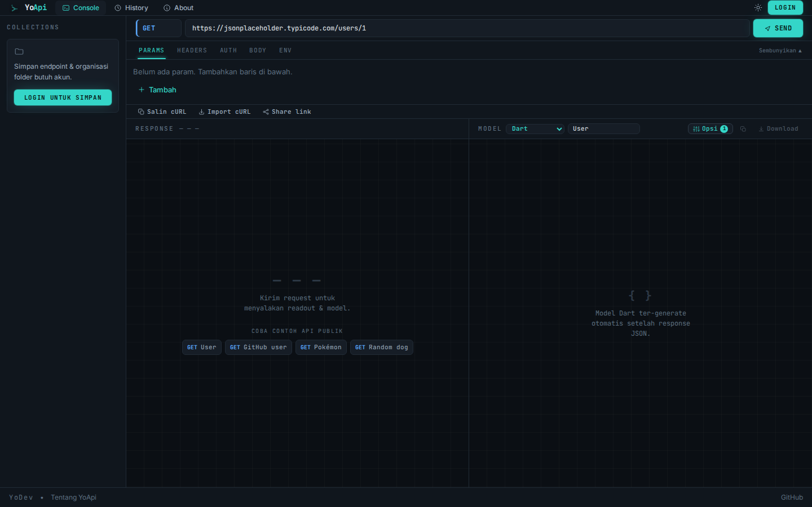
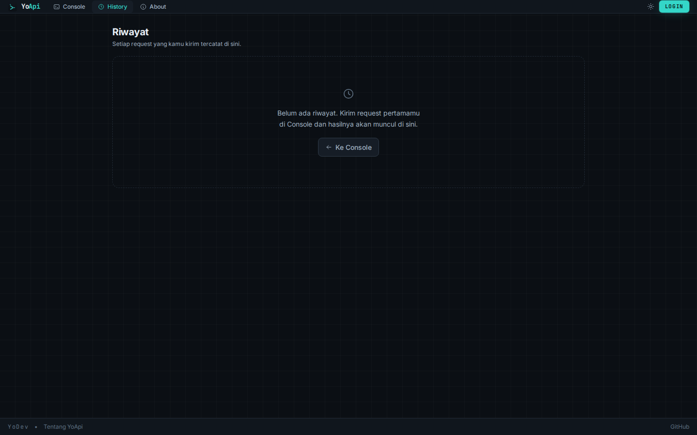
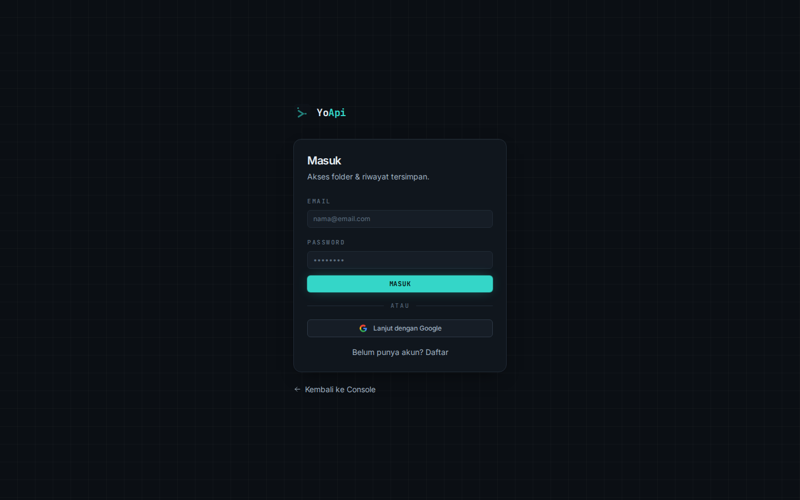
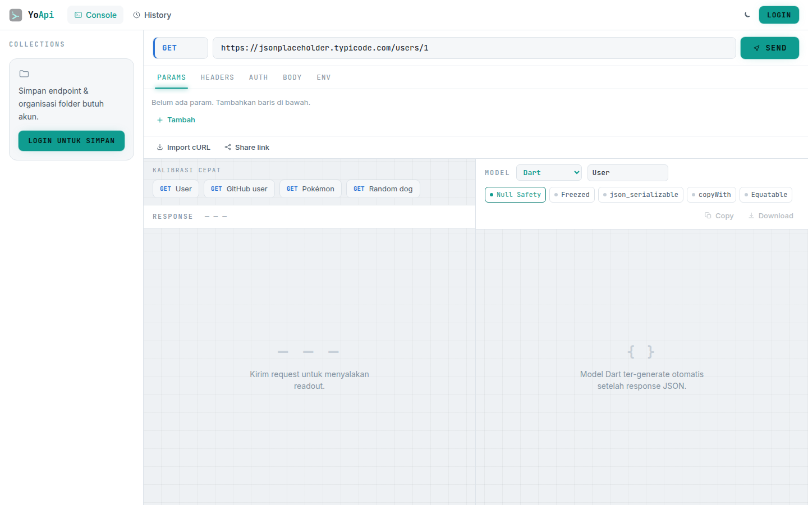
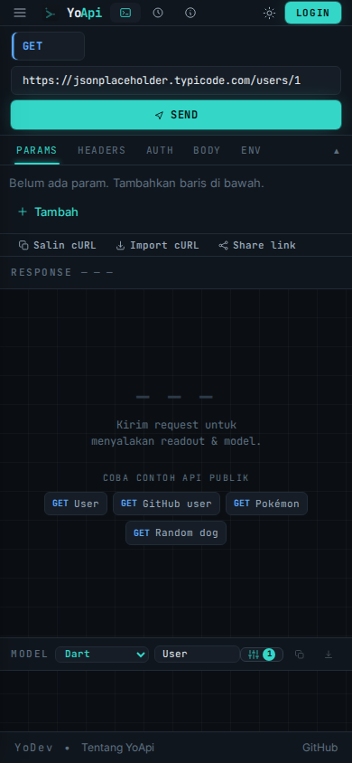
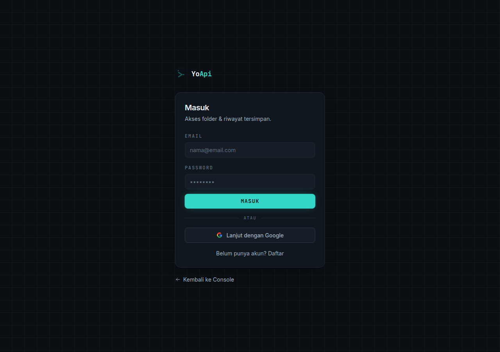
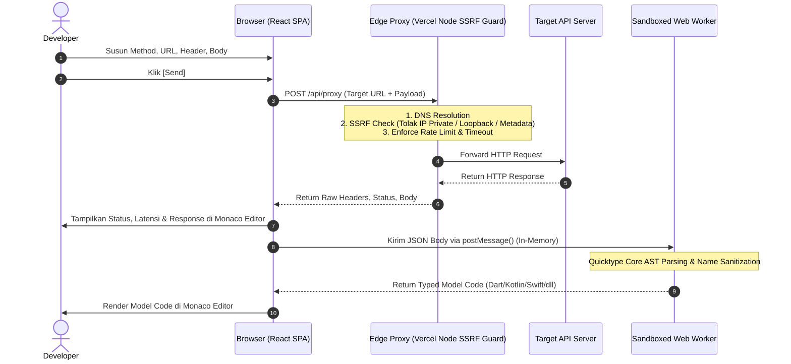

<div align="center">

# ⚡ YoApi

**High-Precision Web-Based REST API Console & Multi-Language Typed Model Generator**

[](https://yoapi.vercel.app)
[](https://www.typescriptlang.org/)
[](https://react.dev/)
[](https://vitejs.dev/)
[](https://github.com/cahyo40/YoAPI)
[](LICENSE)

<p align="center">
  <em>Eksekusi HTTP request seketika tanpa hambatan CORS dan dapatkan model bertipe ketat siap tempel dalam satu tarikan napas — 100% Client-Side Privacy.</em>
</p>

[🚀 Buka Console](https://yoapi.vercel.app) • [📖 Fitur Utama](#-fitur-utama) • [🏗️ Arsitektur & Alur Kerja](#-arsitektur--alur-kerja) • [🧬 Bahasa Target & Opsi](#-bahasa-target--opsi-generator) • [🛡️ Keamanan & Privasi](#-keamanan--privasi) • [📱 PWA](#-progressive-web-app-pwa)

<br/>



</div>

---

## 📌 Daftar Isi

- [💡 Mengapa YoApi?](#-mengapa-yoapi)
- [✨ Fitur Utama](#-fitur-utama)
- [🖼️ Antarmuka & Tampilan](#️-antarmuka--tampilan)
- [🏗️ Arsitektur & Alur Kerja](#-arsitektur--alur-kerja)
- [🧬 Bahasa Target & Opsi Generator](#-bahasa-target--opsi-generator)
- [🛡️ Keamanan & Privasi](#-keamanan--privasi)
- [💻 Panduan Instalasi & Pengembangan Lokal](#-panduan-instalasi--pengembangan-lokal)
- [📱 Progressive Web App (PWA)](#-progressive-web-app-pwa)
- [🎨 Filosofi Desain: The Instrument Panel](#-filosofi-desain-the-instrument-panel)
- [🛠️ Stack Teknologi](#️-stack-teknologi)
- [📄 Lisensi](#-lisensi)

---

## 💡 Mengapa YoApi?

Saat mengintegrasikan REST API ke dalam aplikasi mobile (*Flutter, Kotlin, Swift*) maupun backend/frontend (*TypeScript, Go, Python, Java, C#, Rust*), alur kerja developer konvensional seringkali terfragmentasi:

```
[Alur Konvensional]
1. Buka HTTP Client (Postman/Insomnia) ──► Kirim request & dapatkan JSON
2. Buka tab generator terpisah (misal quicktype.io) ──► Salin & tempel JSON
3. Konfigurasi ulang tipe & bersihkan nama class secara manual
4. Salin hasil kode ──► Buka IDE ──► Tempel ke dalam proyek
```

### ⚡ Solusi YoApi
YoApi memadatkan seluruh siklus tersebut ke dalam **satu instrumen terintegrasi**:

```
[Alur YoApi]
Kirim Request ──► [Response JSON + Model Bertipe Ter-generate Otomatis di Panel Sebelah]
```

- **Nol Copy-Paste Antar Tool**: Response JSON langsung diteruskan ke engine generator di browser.
- **100% Client-Side Privacy**: Data response tidak pernah dikirim ke server YoApi untuk konversi model; seluruh parsing & kompilasi berjalan di dalam sandboxed **Web Worker**.
- **Bypass CORS Otomatis**: Dilengkapi serverless proxy dengan guard **SSRF** kelas industri.

---

## ✨ Fitur Utama

### 1. 🎛️ Konsol Request Presisi
- **Semua HTTP Methods**: Mendukung `GET`, `POST`, `PUT`, `PATCH`, `DELETE`, `HEAD`, dan `OPTIONS`.
- **Editor Komprehensif**: Manajemen Query Params, Headers, Auth, dan Body (JSON & Raw) dengan syntax highlighting dan validasi JSON instan.
- **Collapsible Request Panel**: Panel parameter dapat di-minimize untuk memberikan ruang vertikal maksimal bagi Monaco Editor (mencakup 80%+ tinggi layar).
- **Auth Injector Otomatis**: Dukungan *Bearer Token*, *Basic Auth* (Base64), dan *Custom API Key*.
- **cURL Interoperability**:
  - *Import cURL*: Tempel perintah `curl` apa pun — YoApi otomatis mem-parsing method, URL, headers, dan payload.
  - *Export cURL*: Salin perintah `curl` siap pakai dengan satu klik.
- **Import Postman Collection (v2.x)**: Impor file koleksi Postman JSON langsung ke folder workspace dengan pembersihan otomatis dan flattening struktur folder.
- **Environment Variables**: Substitusi variabel otomatis menggunakan sintaks `{{key}}` yang di-resolve per folder workspace atau session lokal.
- **Shareable State via URL**: Bagikan konfigurasi request langsung lewat URL query tanpa perlu database (*state-in-URL base64url*).

### 2. 📊 Readout Response & Monaco Editor
- **Instrument Telemetry**: Readout status code HTTP (dengan color lamp kalibrasi), latensi respons dalam milidetik (`ms`), dan ukuran payload (`KB/MB`).
- **Monaco Code Editor**: Editor read-only bertenaga VS Code dengan syntax highlighting untuk JSON, XML, HTML, dan Plain Text.
- **Smart Pretty-Print**: Pemformatan otomatis untuk JSON dan XML/HTML terstruktur.
- **In-Body Search**: Pencarian teks cepat dengan match counter dan lompat ke baris yang cocok.
- **Tab Header Response**: Inspeksi seluruh header response yang dikembalikan oleh server target.

### 3. 🧬 Generator Model Bertipe & Symmetrical Options Popover
- **9 Bahasa Target Utama**: Dart (Flutter), Kotlin (Android), Swift (iOS), TypeScript, Go, Python, Java, C#, dan Rust.
- **Zero-Scroll Symmetrical Header**: Seluruh konfigurasi switch generator dikemas ke dalam **Floating Options Popover (`[ ⚙️ Opsi ]`)** yang rapi, menjaga simetri visual dengan panel Response tanpa horizontal scrollbar.
- **Pembersihan Nama Class Otomatis**: Membersihkan prefix ordinal quicktype yang berulang secara cerdas.
- **Multi-Sample Response Merge**: Menggabungkan beberapa response JSON dari endpoint yang sama untuk menghasilkan schema model yang tangguh (field opsional/nullable dideteksi otomatis).
- **One-Click Actions**: Salin kode langsung ke clipboard atau download sebagai file source code (`.dart`, `.kt`, `.swift`, `.ts`, `.go`, `.py`, `.java`, `.cs`, `.rs`).

### 4. 📁 Cloud Workspace & Export ZIP
- **Organisasi Folder**: Kelompokkan request berdasarkan modul atau endpoint, tersinkronisasi lintas perangkat via Cloud Database + Row Level Security (RLS).
- **Sensitive Header Auto-Masking**: Header sensitif seperti `Authorization` atau token otomatis disamarkan saat disimpan ke workspace.
- **Export 1 Folder ke ZIP**: Unduh seluruh koleksi folder dalam 1 file ZIP yang berisi:
  - File JSON request & response mentah.
  - Source code model bertipe untuk setiap endpoint.
  - Model generator untuk body request.
  - Endpoint manifest & dokumentasi ringkas.

### 5. 📜 Riwayat Eksekusi & Diff Tracker
- **Audit Log**: Setiap eksekusi request tercatat lengkap dengan status, URL, durasi, dan waktu.
- **Response Diff Engine**: Bandingkan response saat ini dengan response eksekusi sebelumnya secara berdampingan untuk melacak perubahan schema API.
- **Guest vs User**:
  - *Guest*: Data tersimpan di `localStorage` peramban (kuota 15 req/hari, reset otomatis 24 jam).
  - *User*: Tersinkronisasi cloud tanpa batas kuota.

---

## 🖼️ Antarmuka & Tampilan

<div align="center">

### 🌙 Dark Mode (Default)

**Desktop Console — Skala Compact Pro Density (80% Equivalent)**


<br/>

| Mobile Console | Riwayat Eksekusi & Diff | Layar Masuk / Login |
|:---:|:---:|:---:|
|  |  |  |

<br/>

<details>
<summary><b>☀️ Klik untuk melihat Light Mode Gallery</b></summary>

<br/>

**Desktop Console — Light Mode**


<br/>

| Mobile Console (Light) | Riwayat (Light) | Login (Light) |
|:---:|:---:|:---:|
|  |  |  |

</details>

</div>

---

## 🏗️ Arsitektur & Alur Kerja

YoApi dirancang dengan prinsip **Client-First Privacy** dan **Edge Serverless Proxy**.



### Komponen Sistem:
1. **Frontend Client (React 18 + Vite 6 + Tailwind CSS)**:
   - Single Page Application yang bertindak sebagai orchestrator instrumen.
2. **Edge Proxy (`api/proxy.ts`)**:
   - Vercel Serverless Function (Region `sin1` - Singapore) yang menjembatani request untuk melewati batasan CORS tanpa memerlukan ekstensi browser tambahan.
   - Dilengkapi guard **Server-Side Request Forgery (SSRF)** berbasis DNS lookup yang memblokir alamat IP privat, loopback, link-local, dan AWS/GCP cloud metadata.
3. **Engine Kompilasi (Web Worker)**:
   - Menjalankan `quicktype-core` di thread latar belakang (*off-main-thread*), memastikan antarmuka tetap berjalan pada 60 FPS tanpa freeze saat memproses payload JSON besar (hingga 2 MB).

---

## 🧬 Bahasa Target & Opsi Generator

YoApi mendukung generasi model bertipe untuk 9 bahasa pemrograman dengan opsi lanjutan:

| Bahasa Target | Ekstensi | Fitur & Opsi Generator Khusus |
|---|:---:|---|
| **Dart (Flutter)** | `.dart` | • **Null Safety** (`?` dan `required`)<br/>• **Freezed** (`@freezed` immutable class + unions)<br/>• **json_serializable** (`@JsonSerializable()` converter)<br/>• **copyWith** (Method kloning objek dinamis)<br/>• **Equatable** (Value equality tanpa boilerplate `props`) |
| **Kotlin (Android)** | `.kt` | • Data class dengan anotasi `@JsonProperty` / `@SerialName` |
| **Swift (iOS)** | `.swift` | • Struct conforming to `Codable` / `Identifiable` |
| **TypeScript** | `.ts` | • Strict interfaces, type aliases, dan convert helpers |
| **Go** | `.go` | • Struct bertipe dengan tag `json:"..."` |
| **Python** | `.py` | • **Pydantic `BaseModel`** (validasi tipe runtime) vs Python Standard `dataclass` |
| **Java** | `.java` | • **Lombok `@Data`** (menghilangkan boilerplate getter/setter) |
| **C# (.NET)** | `.cs` | • **`System.Text.Json`** (default modern .NET) vs `Newtonsoft.Json` |
| **Rust** | `.rs` | • Struct bertipe dengan **`#[derive(Debug, Clone, Serialize, Deserialize)]`** |

---

## 🛡️ Keamanan & Privasi

Keamanan dan integritas data developer adalah fondasi utama YoApi:

- 🔒 **Zero-Server Inspection**: Konten response JSON Anda **tidak pernah disimpan atau dikirim ke server YoApi** untuk keperluan konversi. Pemrosesan model 100% lokal di browser.
- 🛡️ **SSRF Guard Kelas Industri**:
  - Proxy melakukan resolving DNS terlebih dahulu sebelum membuka koneksi TCP.
  - Memblokir `127.0.0.0/8`, `10.0.0.0/8`, `172.16.0.0/12`, `192.168.0.0/16`, `169.254.0.0/16` (metadata AWS/GCP), `::1`, `fc00::/7`, dan `fe80::/10`.
- ⏱️ **Proteksi DoS & Resource Capping**:
  - Batas ukuran response maksimal 10 MB.
  - Batas konversi worker maksimal 2 MB.
  - Rate limiting proxy default 60 req/menit per IP.
  - Timeout eksekusi 25 detik (mencegah hanging socket).
- 🔑 **Cloud Row Level Security (RLS)**:
  - Seluruh tabel database diamankan dengan kebijakan RLS ketat.
  - Klien frontend hanya memegang public client key; kunci administratif tidak pernah diekspos.
- 🎭 **Sensitive Header Masking**:
  - Header seperti `Authorization`, `X-Api-Key`, `Cookie`, dan `Token` secara otomatis disamarkan (`••••••••`) saat disimpan ke cloud folder untuk mencegah kebocoran kredensial tim.

---

## 💻 Panduan Instalasi & Pengembangan Lokal

### Prasyarat
- **Node.js**: versi 20.x atau 22.x+
- **npm** atau **pnpm** / **yarn**

### 1. Clone Repositori
```bash
git clone https://github.com/cahyo40/YoAPI.git
cd YoAPI
```

### 2. Instal Dependensi
```bash
npm install
```

### 3. Konfigurasi Environment Variable
Salin file template `.env.example` menjadi `.env.local`:
```bash
cp .env.example .env.local
```

Isi variabel koneksi cloud backend Anda pada `.env.local`:
```env
VITE_SUPABASE_URL=https://your-cloud-project.domain.co
VITE_SUPABASE_ANON_KEY=your-client-key-here
```

### 4. Jalankan Server Pengembangan
```bash
npm run dev
```
Buka browser di `http://localhost:5173`. Server dev Vite telah dilengkapi dengan *local proxy middleware* terintegrasi sehingga request `/api/proxy` langsung berfungsi secara lokal.

### 5. Menjalankan Pengujian (Unit & Integration Tests)
YoApi dilengkapi dengan 58 automated tests (Node native test runner):
```bash
npm test
```

### 6. Build untuk Produksi
```bash
npx tsc --noEmit && npm run build
```

---

## 📱 Progressive Web App (PWA)

YoApi dapat diinstal secara native di perangkat Desktop maupun Mobile sebagai Progressive Web App:

- **Instalasi Desktop**: Klik ikon install di bilah alamat browser (Chrome, Edge, Brave).
- **Instalasi Android**: Buka menu Chrome $\rightarrow$ pilih *"Add to Home Screen"*.
- **Instalasi iOS**: Buka di Safari $\rightarrow$ tap tombol *Share* $\rightarrow$ pilih *"Add to Home Screen"*.
- **Offline Shell**: Service worker meng-cache asset aplikasi statis, memungkinkan navigasi instan.

---

## 🎨 Filosofi Desain: The Instrument Panel

YoApi dirancang dengan estetika visual **"Precision Instrument Console"**:

- **Dark-First Mastery**: Skema warna warm near-black (`#0b0f14`), menghindari pure black `#000` yang melelahkan mata.
- **Luminous Signal Accent**: Warna sinyal cyan instrumen (`#34d6c8`) digunakan secara presisi hanya untuk status aktif dan aksi utama.
- **Calibrated Pro Density**: Kepadatan visual disesuaikan dengan skala 80% default zoom agar area Monaco Editor memiliki ruang pandang optimal setara IDE profesional.
- **JetBrains Mono & Inter**: Menggunakan *JetBrains Mono* untuk seluruh angka dan token data tabular, serta *Inter* untuk keterbacaan teks.
- **WCAG AA Compliance**: Rasio kontras teks di atas tombol dan panel memenuhi standar aksesibilitas internasional.

---

## 🛠️ Stack Teknologi

| Komponen | Teknologi | Deskripsi |
|---|---|---|
| **Frontend Framework** | React 18.3 | Library UI berbasis komponen fungsional & hooks |
| **Build Tool & Bundler** | Vite 6.0 | Toolchain build super cepat dengan HMR instan |
| **Bahasa Pemrograman** | TypeScript 5.7 | Static typing ketat (*strict mode*) |
| **Styling** | Tailwind CSS 3.4 | Utility-first CSS dengan token kustom instrumen |
| **Code Editor** | Monaco Editor | Engine editor read-only bertenaga VS Code |
| **Generator Engine** | quicktype-core | Parser schema JSON & compiler model di Web Worker |
| **Database & Auth** | Cloud Database & Auth | PostgreSQL, OAuth + Email Auth, Row Level Security |
| **Routing** | React Router v6/v7 | Declarative client-side routing |
| **Hosting & Edge** | Vercel | Serverless Functions, Edge Network, Global CDN (Region `sin1`) |

---

## 📄 Lisensi

Hak Cipta © 2026 **cahyo40**. Seluruh hak dilindungi undang-undang (*All Rights Reserved*).

Dibuat dengan ❤️ untuk komunitas developer Flutter, Mobile, dan Full-Stack.

